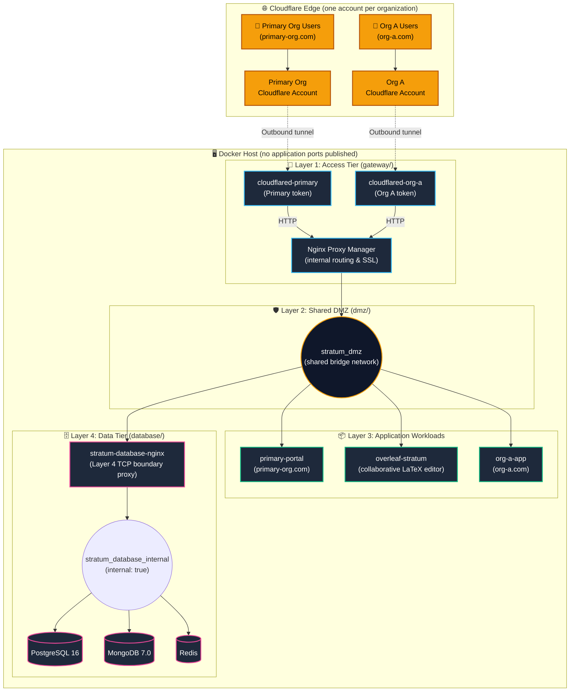
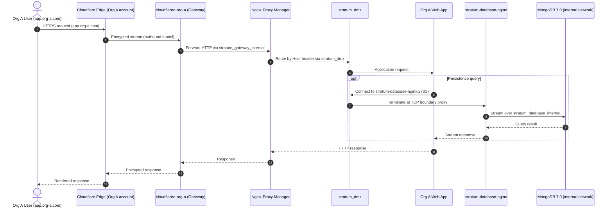
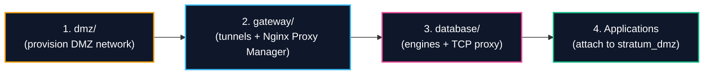

# Stratum-Core — Self-Hosted Multi-Organization Container Infrastructure with Zero-Trust Ingress

> *"Isolation by design, not by discipline."*

[](https://github.com/sandra-puerto/stratum-core)
[](https://sandrapuerto.com)
[](gateway/README.md)
[](SECURITY.md)
[](LICENSE)

**Stratum-Core** is a self-hosted infrastructure orchestration pattern for running containerized workloads of **several independent organizations** on a single Docker host (or a small set of hosts) without publishing any application port to the public interface.

Designed and implemented by **Sandra Gabriela Puerto Torres**, Stratum addresses the cost and complexity of hosting multiple organizations' applications on managed cloud services. It lets independent organizations share one host while keeping their **ingress paths, credentials and data tier separated**, and without port collisions.

---

## 1. Summary & Motivation

Single-server Docker deployments that host more than one client tend to run into three structural problems:

1. **Network sprawl and port collisions:** several applications and domains compete for host ports (`80`, `443`, `3306`), which leads to brittle port-mapping workarounds.
2. **Recurring cost of managed services:** load balancers, multi-VPC gateways and managed database instances can be disproportionate for small and medium workloads.
3. **Flat networks:** containers on default bridge networks can reach each other and the databases, with no defined boundary around the data tier.

Stratum-Core addresses them through **topological island isolation and per-organization tunnels**:

* **Self-managed, lower recurring cost:** several organizations run on one self-managed host instead of separate managed services.
* **Per-organization ingress:** each organization runs its own `cloudflared` process with its own tunnel token. Organizations connect their own Cloudflare accounts, WAF rules and access policies without sharing credentials.
* **No application ports published on the host:** all web ingress arrives through authenticated outbound Cloudflare Tunnels.
* **Boundary client pattern:** the persistence engines live on a network with `internal: true` (no external egress) and are reached only through a Layer 4 TCP proxy.

> **Dependency note:** the pattern runs on any Docker host, but its ingress layer depends on Cloudflare Tunnel.

---

## 2. Architecture

### 2.1 Platform Topology



---

## 3. Components

Stratum is split into three components. Each one is an independent Compose project with its own lifecycle, configuration and network:

| Component | Responsibility | Network | Isolation |
| :--- | :--- | :--- | :--- |
| [`dmz/`](dmz/) | Shared network provisioning | `stratum_dmz` | Convergence bridge between tiers |
| [`gateway/`](gateway/) | Per-organization tunnels and reverse proxy | `stratum_gateway_internal` | Egress-only access tier |
| [`database/`](database/) | PostgreSQL, MongoDB, Redis and TCP boundary proxy | `stratum_database_internal` | Internal network (`internal: true`) |

---

## 4. Request Flow



---

## 5. Security Baseline

The hardening specification below is applied to the containers in each tier **where the image supports it**. Some images (for example Nginx Proxy Manager or the database engines) require writable paths, which are handled through volumes or `tmpfs`.

```
                         ┌────────────────────────────────────┐
                         │   STRATUM HARDENING BASELINE       │
                         ├────────────────────────────────────┤
                         │ • read_only: true (where possible) │
                         │ • cap_drop: [ALL]                  │
                         │ • no-new-privileges: true          │
                         │ • tmpfs for volatile paths         │
                         │ • internal: true for the data tier │
                         │ • Memory, CPU & PID constraints    │
                         │ • Log rotation (10 MB x 3)         │
                         └────────────────────────────────────┘
```

### 5.1 What the design provides

* **No application ports on the host:** the host does not publish `80`, `443` or database ports. Cloudflare terminates TLS at the edge and forwards requests through authenticated outbound tunnels.
* **Per-organization ingress separation:** organizations do not share Cloudflare API keys or tunnel credentials. Each one runs a separate `cloudflared` process.
* **Defined data-tier boundary:** the database engines (`postgres`, `mongodb`, `redis`) sit on `stratum_database_internal` (`internal: true`), with no external egress. Applications reach them only through the TCP boundary proxy, and still need valid database credentials.
* **Immutable root filesystem where supported:** with `read_only: true`, containers cannot modify their own root filesystem. Temporary files go to capped `tmpfs` mounts.

### 5.2 Scope and limitations

* **Applications share `stratum_dmz`.** Isolation between organizations is enforced at the ingress layer (separate tunnels and credentials) and at the data tier (credentials per database or user). It is **not** enforced between application containers: any container on `stratum_dmz` can reach the other applications and the database proxy. A compromised application therefore reaches the DMZ, not only itself.
* **Stronger tenant isolation** requires a separate network per organization and separate database credentials with minimal privileges. This is a recommended extension and is not part of the current baseline.
* **Ingress depends on Cloudflare Tunnel.** The host does not publish ports, but availability and access policies at the edge depend on that service.

---

## 6. Deployment Runbook

The components must be started in order to satisfy the Docker network dependencies.



### 6.1 Commands

```bash
# 1. Provision the shared DMZ network
cd dmz/
cp .env.example .env && chmod 600 .env
docker compose up -d

# 2. Deploy the access tier
cd ../gateway/
cp .env.example .env && chmod 600 .env

# Primary organization only:
docker compose up -d

# Primary + Org A (Compose profile):
docker compose --profile org-a up -d

# All configured organizations:
docker compose --profile all up -d

# 3. Deploy the data tier and boundary proxy
cd ../database/
cp .env.example .env && chmod 600 .env
docker compose up -d
```

### 6.2 Verification

```bash
# Container health and networks across tiers
docker ps --format "table {{.Names}}\t{{.Status}}\t{{.Networks}}"

# Network segmentation
docker network ls | grep stratum
```

Expected networks:
* `stratum_dmz` (bridge, shared between tiers)
* `stratum_gateway_internal` (bridge, tunnel ingress)
* `stratum_database_internal` (bridge, `internal: true`)

---

## 7. Repository Structure

```
stratum-core/
├── LICENSE                 # MIT-based custom license (commercial use permitted)
├── README.md               # Architecture and technical specification
├── SECURITY.md             # Vulnerability disclosure protocol
├── CONTRIBUTING.md         # Contribution guidelines
├── .gitignore              # Exclusion rules
├── dmz/                    # Shared DMZ network
│   ├── docker-compose.yml
│   ├── .env.example
│   └── README.md
├── gateway/                # Per-organization tunnels + reverse proxy
│   ├── docker-compose.yml
│   ├── .env.example
│   └── README.md
└── database/               # Data tier and boundary proxy
    ├── docker-compose.yml
    ├── .env.example
    ├── README.md
    └── nginx/
        └── nginx.conf      # Layer 4 TCP stream configuration
```

---

## 8. Author

**Stratum-Core** was designed and implemented by **Sandra Gabriela Puerto Torres**.

* **Role:** Backend Developer (PHP/Laravel) and infrastructure
* **Approach:** *Systems should be financially viable, structurally separated and resilient, without requiring oversized cloud budgets.*
* **Intended use cases:** self-hosted platforms for small organizations, agencies hosting several clients, and managed-service scenarios on private infrastructure.
* **Stack:** PHP/Laravel, Linux, Docker, Proxmox VE, Cloudflare Tunnel, Nginx
* **Website:** [https://sandrapuerto.com](https://sandrapuerto.com)
* **Contact:** [contacto@sandrapuerto.com](mailto:contacto@sandrapuerto.com)

---

## 9. License

Distributed under an MIT-based custom license that requires private disclosure of security vulnerabilities. Commercial and multi-organization hosting use is permitted. See [LICENSE](LICENSE) for the full text.
