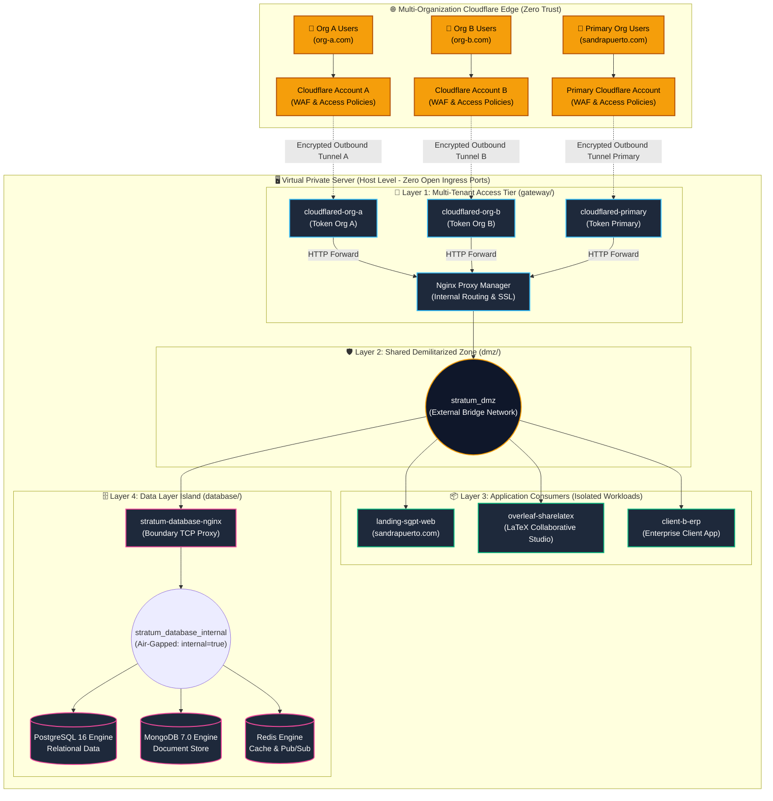
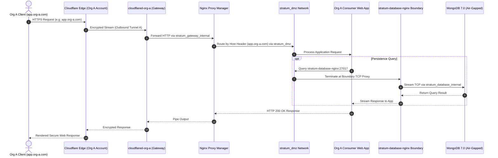
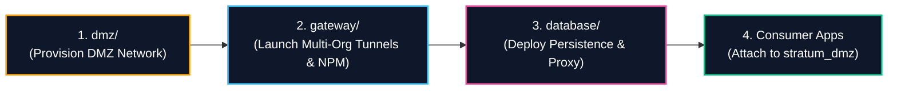

# Stratum-Core — Multi-Tenant Zero-Trust Infrastructure & Island Isolation Architecture

> *"Isolation by design, not by discipline. Built for multi-tenant and multi-organization enterprise scale."*

[-4f46e5?style=for-the-badge&logo=docker&logoColor=white)](https://github.com/sandrapuerto/stratum-core)
[](https://sandrapuerto.com)
[](gateway/README.md)
[](SECURITY.md)
[-yellow.svg?style=for-the-badge)](LICENSE)

**Stratum-Core** is an enterprise-grade, cloud-agnostic infrastructure orchestration pattern designed for deploying **multi-tenant, multi-organization, zero-trust containerized workloads** on single or hybrid virtual private servers (VPS).

Engineered by **Sandra Gabriela Puerto Torres**, Stratum solves the friction between high operational cloud costs (OPEX) and enterprise-grade multi-organization isolation. It enables independent enterprise clients and diverse workloads to coexist securely on a unified physical/virtual host without port collisions, public surface exposure, or operational cross-contamination.

---

## 1. Executive Summary & Engineering Motivation

Traditional single-server Docker deployments and multi-client hosting suffer from three structural failure modes:
1. **Network Sprawl & Port Collisions:** Multiple applications and client domains competing for host ports (`80`, `443`, `3306`), leading to brittle port-mapping workarounds.
2. **Excessive Cloud OPEX:** Over-reliance on expensive managed cloud services (e.g., dedicated load balancers, multi-VPC gateways, managed database instances) for modest to medium enterprise workloads.
3. **Implicit Lateral Movement & Tenant Cross-Contamination:** Containers sharing default bridge networks without segmentation, allowing a compromised client container to query internal databases and neighbor workloads.

**Stratum-Core** eliminates these failure modes through **Topological Island Isolation & Multi-Organization Tunnels**:
* **-60% to -80% OPEX Reduction:** Consolidates multiple isolated enterprise organizations onto self-managed infrastructure with zero cloud-vendor lock-in.
* **Multi-Organization Zero-Trust Ingress:** Supports $N$ independent Cloudflare Zero-Trust Tunnels concurrently. Distinct client organizations connect their own Cloudflare accounts, WAF rules, and SSO/IdP policies without credential sharing.
* **100% Ingress Cloaking:** Zero inbound open ports on the physical host. All ingress traffic is terminated exclusively via authenticated outbound Cloudflare Tunnels.
* **Boundary Client Pattern:** Persistence engines exist in air-gapped internal networks (`internal: true`) and can only be reached via hardened Layer 4 TCP stream boundary clients.

---

## 2. High-Level Architecture

### 2.1 Multi-Organization Platform Topology



---

## 3. Core Component Matrix

Stratum is modularized into three autonomous components, each maintaining an independent Compose project, lifecycle, configuration, and security perimeter:

| Component | Responsibility | Provisioned Network | Isolation Level |
| :--- | :--- | :--- | :--- |
| [`dmz/`](dmz/) | Shared network provisioning & persistence anchor | `stratum_dmz` | Inter-island convergence bridge |
| [`gateway/`](gateway/) | Multi-organization ingress tunnels & reverse proxying | `stratum_gateway_internal` | Multi-tenant egress-only access tier |
| [`database/`](database/) | Multi-engine persistence & boundary stream proxy | `stratum_database_internal` | Air-gapped internal data tier |

---

## 4. Multi-Organization Traffic Flow Model



---

## 5. Security & Hardening Baseline

Every container deployed across Stratum-Core adheres strictly to the **Stratum Hardening Specification**:

```
                         ┌────────────────────────────────────┐
                         │   STRATUM HARDENING BASELINE       │
                         ├────────────────────────────────────┤
                         │ • read_only: true (Immutable root) │
                         │ • cap_drop: [ALL]                  │
                         │ • no-new-privileges: true          │
                         │ • tmpfs for volatile paths         │
                         │ • internal: true for data bridges  │
                         │ • Multi-organization profiles      │
                         │ • Memory, CPU & PID constraints    │
                         │ • Structured log-rotation (10MBx3) │
                         └────────────────────────────────────┘
```

### 5.1 Defense-in-Depth Attributes

* **No Inbound Public Ports:** The VPS does not listen on ports `80`, `443`, or database ports. Cloudflare handles edge TLS termination and forwards requests through authenticated outbound tunnels.
* **Tenant Ingress Separation:** Organizations do not share Cloudflare API keys or tunnel credentials. Each organization operates a discrete, isolated `cloudflared` process.
* **Zero Trust Lateral Movement:** Compromising a web application gives an attacker access only to `stratum_dmz`. The database storage engines (`postgres`, `mongodb`, `redis`) reside on `stratum_database_internal` (`internal: true`), completely unreachable without credentials through the TCP proxy.
* **Static Host Integrity:** Containers cannot write to their own root filesystem (`read_only: true`). Temporary execution files reside in capped RAM mounts (`tmpfs`).

---

## 6. Deployment & Orchestration Runbook

The components must be initialized sequentially to satisfy Docker network dependency graphs.



### 6.1 Provisioning Commands

```bash
# 1. Provision the Shared DMZ Network
cd dmz/
cp .env.example .env && chmod 600 .env
docker compose up -d

# 2. Deploy the Ingress Access Layer
cd ../gateway/
cp .env.example .env && chmod 600 .env

# Standard (Primary Organization only):
docker compose up -d

# Or Multi-Organization with Profiles (e.g. Org A + Primary):
docker compose --profile org-a up -d

# Or all configured organizations:
docker compose --profile all up -d

# 3. Deploy the Data Layer & Boundary Proxy
cd ../database/
cp .env.example .env && chmod 600 .env
docker compose up -d
```

### 6.2 State Verification

```bash
# Verify container health across all Stratum tiers
docker ps --format "table {{.Names}}\t{{.Status}}\t{{.Networks}}"

# Verify network segmentation
docker network ls | grep stratum
```

Expected Network Inventory:
* `stratum_dmz` (Bridge / External Convergence)
* `stratum_gateway_internal` (Bridge / Multi-Tunnel Ingress)
* `stratum_database_internal` (Bridge / Air-Gapped `internal: true`)

---

## 7. Repository Structure

```
stratum-core/
├── LICENSE                 # Enhanced MIT License (Commercial & Multi-Tenant Permitted)
├── README.md               # Master Architecture & Technical Specification
├── SECURITY.md             # Responsible Vulnerability Disclosure Protocol
├── CONTRIBUTING.md         # Multi-Tenant Contribution Guidelines
├── .gitignore              # Multi-tier exclusion rules
├── dmz/                    # Shared DMZ Network Anchor & Topology
│   ├── docker-compose.yml  # Network lifecycle container
│   ├── .env.example        # Network parameter definitions
│   └── README.md           # DMZ component manual & subnet specs
├── gateway/                # Multi-Tenant Ingress & Access Tier
│   ├── docker-compose.yml  # Multi-Tunnel cloudflared + Nginx Proxy Manager
│   ├── .env.example        # Multi-org tokens & configuration
│   └── README.md           # Gateway routing manual & TLS administration
└── database/               # Data Persistence & Boundary Tier
    ├── docker-compose.yml  # PostgreSQL + MongoDB + Redis + TCP Proxy
    ├── .env.example        # Root credentials & memory configurations
    ├── README.md           # Data operations, backup & rotation manual
    └── nginx/
        └── nginx.conf      # Layer 4 TCP Stream Boundary configuration
```

---

## 8. Author & Commercial Architecture Provenance

**Stratum-Core** was conceived, architected, and implemented by **Sandra Gabriela Puerto Torres**.

* **Role:** Backend Developer & Technical Infrastructure Director
* **Core Philosophy:** *Systems must be financially viable, structurally isolated, and resilient to operational turbulence without requiring oversized cloud budgets.*
* **Commercial Applications:** SaaS Platforms, Managed Service Providers (MSP), Agency Multi-Client Infrastructure, Enterprise Private Clouds.
* **Specialization:** PHP/Laravel, Linux Systems, Network Topology, Proxmox VE, Cloudflare Edge Architecture, Container Hardening.
* **Website:** [https://sandrapuerto.com](https://sandrapuerto.com)
* **Contact:** [contacto@sandrapuerto.com](mailto:contacto@sandrapuerto.com)

---

## 9. License

This repository is distributed under an enhanced MIT License with a mandatory private security vulnerability disclosure requirement. Commercial and multi-tenant hosting use is fully permitted. See [LICENSE](LICENSE) for full legal text.